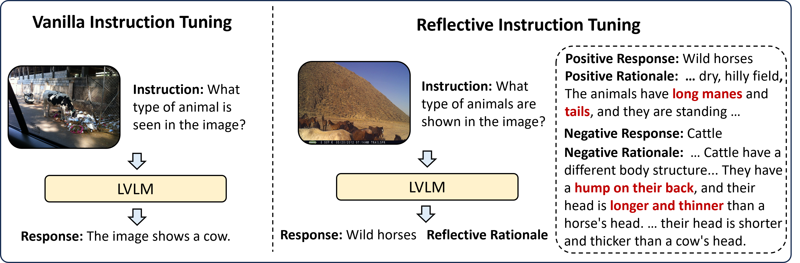

# Reflective Instruction Tuning: Mitigating Hallucinations in Large Vision-Language Models
<div align="center">
<a src="https://img.shields.io/badge/project-page-blue" href="https://zjr2000.github.io/projects/reverie">
  
</a>
<a src="https://img.shields.io/badge/arXiv-2407.11422-b31b1b.svg" href="https://arxiv.org/abs/2407.11422">

</a>
<a src="https://img.shields.io/badge/REVERIE-datasets-yellow" href="https://huggingface.co/datasets/zjr2000/REVERIE">

</a>
</div>

## Introduction

we propose reflective instruction tuning, which integrates rationale learning into visual instruction tuning. Unlike previous methods that learning from responses only, our approach entails the model predicting rationales justifying why responses are correct or incorrect. This fosters a deeper engagement with the fine-grained reasoning underlying each response, thus enhancing the models reasoning proficiency. To facilitate this approach, we propose REVERIE, the first large-scale instruction-tuning dataset with ReflEctiVE RatIonalE annotations. REVERIE comprises 115k machine-generated reasoning instructions, each meticulously annotated with a corresponding pair of correct and confusing responses, alongside comprehensive rationales elucidating the justification behind the correctness or erroneousness of each response.



## The REVERIE Dataset

### Download
1. Download images:
    - VisualGenome: [part1](https://cs.stanford.edu/people/rak248/VG_100K_2/images.zip), [part2](https://cs.stanford.edu/people/rak248/VG_100K_2/images2.zip) 
    - COCO: [train2017](http://images.cocodataset.org/zips/train2017.zip)
    - ScienceQA: [train images](https://drive.google.com/drive/folders/1w8imCXWYn2LxajmGeGH_g5DaL2rabHev)
2. Download annotations from [huggingface](https://huggingface.co/datasets/zjr2000/REVERIE)

### Generation
We provide scripts for reflective annotation generation. Follow these steps to generate the data::
1. Prepare ```image_list.json```: This file should contain a list of image names and be placed under ```$TARGET_FOLDER```.
2. Generate instruction and response:
```
python dataset_generation_pipeline/gemini_v_qa_collection.py \
    --image_folder $IMAGE_FOLDER \
    --target_folder $TARGET_FOLDER \
    --api_key $API_KEY \
    --num_tasks $NUM_TASKS
```
3. Generate positive and negative rationales:
```
python dataset_generation_pipeline/gemini_v_rationale_collection.py \
    --target_folder $TARGET_FOLDER \
    --api_key $API_KEY \
    --num_tasks $NUM_TASKS
```
4. Consistency-based data filtering:
```
python dataset_generation_pipeline/data_filter.py \
    --target_folder $TARGET_FOLDER \
    --api_key $API_KEY \
    --num_tasks $NUM_TASKS
```
The resulting ```rationale_instruct_data_with_judge.json``` will contain the final generated data, including instructions, responses, rationales, and flags indicating their correctness.

## Models

We perform reflective instruction tuning on several open-sourced LVLMs. Please refer to their repositories for instructions on setting up the environments and running the models: 
- [LLaVA](https://github.com/haotian-liu/LLaVA)
- [MoE-LLaVA](https://github.com/PKU-YuanGroup/MoE-LLaVA) 
- [LLaVA-phi3](https://github.com/mbzuai-oryx/LLaVA-pp)

### Checkpoints and Results:
We also provide checkpoints and prediction results to facilitate the reproduction of our results:
#### Checkpoints:
| Model | data | Baseline | Checkpoints |
|----------|----------|----------|-------|
| REVERIE-1.0-7b-lora   | LLaVA-Instruct-80K + REVERIE |[LLaVA-1.0-7b-lora](https://github.com/haotian-liu/LLaVA)  |    [Baidu Disk Link](https://pan.baidu.com/s/1Yp5gYe5D1_VhDOTBNorHCQ?pwd=xf7e)   |
| REVERIE-1.5-7b-lora    | LLaVA-665k + REVERIE | [LLaVA-1.5-7b-lora](https://github.com/haotian-liu/LLaVA)  |   [Baidu Disk Link](https://pan.baidu.com/s/1UDob1xq3dvjGpv14H7XNSg?pwd=mkzu)    |
| MOE-REVERIE-1.6Bx4   | LLaVA-665k + REVERIE   | [MOE-LLaVA-1.6Bx4](https://github.com/PKU-YuanGroup/MoE-LLaVA)  |[Baidu Disk Link](https://pan.baidu.com/s/1d4d0zXI5TVCmoBwMngWoHg?pwd=osyw)|
| REVERIE-Phi3-lora  | LLaVA-665k + REVERIE   | [LLaVA-Phi3-lora](https://github.com/mbzuai-oryx/LLaVA-pp)  |[Baidu Disk Link](https://pan.baidu.com/s/10DwB0klgmXQNpu-j3xdbJA?pwd=kcua )|
#### Prediction Files:
| Benchmark | Results |
|----------|----------|
| ScienceQA | [Baidu Disk Link](https://pan.baidu.com/s/1_rZVUi_iDNCi1Se9M63Y1A?pwd=o2ss)|
| MMBench | [Baidu Disk Link](https://pan.baidu.com/s/1QYv24gNZW5M0ix88xDW3ag?pwd=527b)|
| POPE | [Baidu Disk Link](https://pan.baidu.com/s/1shVTHFkshstY4CkuRvysKg?pwd=52zo)|

## Citation
If you find this repo helpful, please consider citing:
```bibtex
@article{zhang2024reflective,
  title={Reflective Instruction Tuning: Mitigating Hallucinations in Large Vision-Language Models},
  author={Zhang, Jinrui and Wang, Teng and Zhang, Haigang and Lu, Ping and Zheng, Feng},
  journal={arXiv preprint arXiv:2407.11422},
  year={2024}
}
```

## Acknowledgements
Our experiments are conducted on several awesome open-soured LVLMs: [LLaVA](https://github.com/haotian-liu/LLaVA), [MoE-LLaVA](https://github.com/PKU-YuanGroup/MoE-LLaVA) and [LLaVA-phi3](https://github.com/mbzuai-oryx/LLaVA-pp). We thank the authors for their efforts.